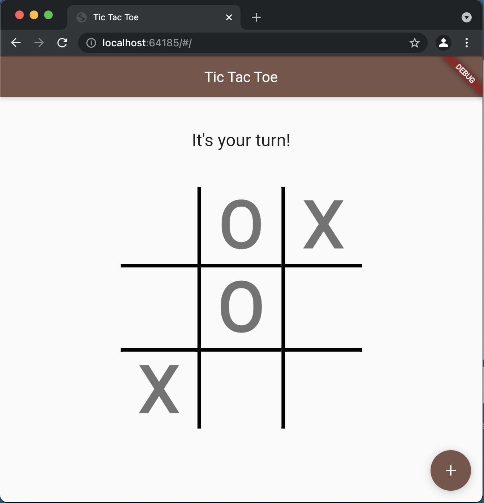

# tic_tac_toe_ui

## Summary

`tic_tac_toe_ui`  UI to play tic tac toe, connects to an api to play the computer

## How to Run Locally

  - **Prerequisites**:  
    1. ✔ go go1.16.6 darwin/amd64
    2. ✔ Flutter 2.2.3
    3. ✔ Dart 2.13.4
    4. ✔ Chrome browser
    5. ✔ [tic-tac-toe-api](https://github.com/cosbor11/tic-tac-toe-api)
   

  - **Running**:
    1.  ✔  Before starting the UI, clone and launch `tic-tac-toe-api` See the [tic-tac-toe-api/README.md](https://github.com/cosbor11/tic-tac-toe-api/blob/main/README.md) for steps
    2.  ✔  run `flutter pub get` to install the dependencies
    3.  ✔  run: `flutter run` to launch the application
    4.  ✔  interact with the application using chrome 

## Screenshot

## Details

 - When the screen first launches, user will be prompted with a `StartupDialog` and must select either "X"  or "O"
 - If they select "X', they go first
 - After making a move, a request is sent to `tic-tac-toe-api` to get the computers next move. The request sent to the api should include the player the computer is using and the moves that have already been played so that it can constuct a game state.
 - The UI is then updated with the computers move, and will evaluate if there is a winner or stalemate each time a move is played. 

ENJOY!

@author Chris Osborn

